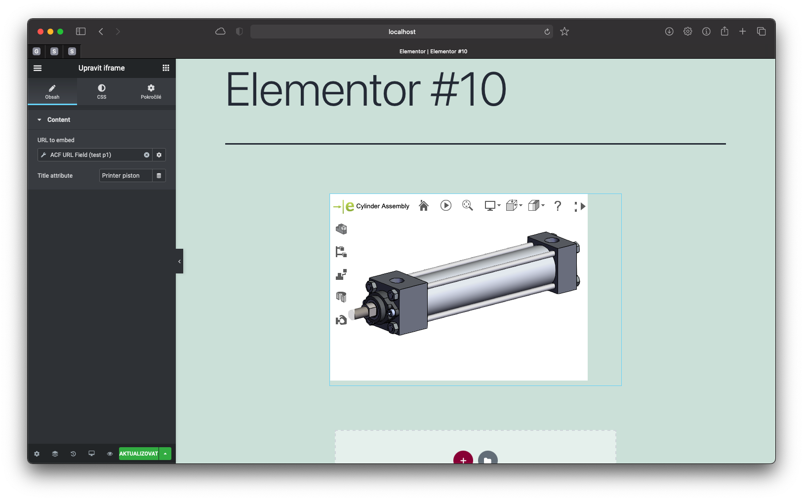

# Elementor Iframe Widget
- Author URI: [http://jakubforman.eu](http://jakubforman.eu)
- Contributors: JayJay666
- Tags: elementor, elementor addon, elementor extension, elements, widgets, iframe, elementor iframe, elementor widget, jayjay666
- Last release [Download latest version](https://github.com/JayJay666/elementor-iframe-widget/releases)
- License: GPL v2 or later
- License URI: http://www.gnu.org/licenses/gpl-2.0.html

## Description

Elementor Iframe Widget is a open source plugin adding `<iframe>` widget to the Elementor library. With Elementor Pro 
enable dynamic tags! All widgets & extension that can be used with
[Elementor page builder](https://wordpress.org/plugins/elementor/)

### Installation and usage

1. Install and activate the **required plugin** [Elementor page builder](https://wordpress.org/plugins/elementor/).
2. Unzip the downloaded elementor-iframe-widget.zip file and upload to the '/wp-content/plugins/' directory. Activate the
   plugin through the 'Plugins' menu in WordPress
3. Create new page and start creating page with Elementor and Elementor Iframe Widget :)

### Frequently Asked Questions

* Does it work with the theme that I am using ?

Our tests indicate that the elements work well with most themes that are well coded.

* Will this plugin be available in wordpress.org ?

Time will tell. When we estimate plugin has enough added functionalities to Elementor, or some other reason, it will be
available on wp.org. So far, install it from GitHub (**Download stable version zip**).

